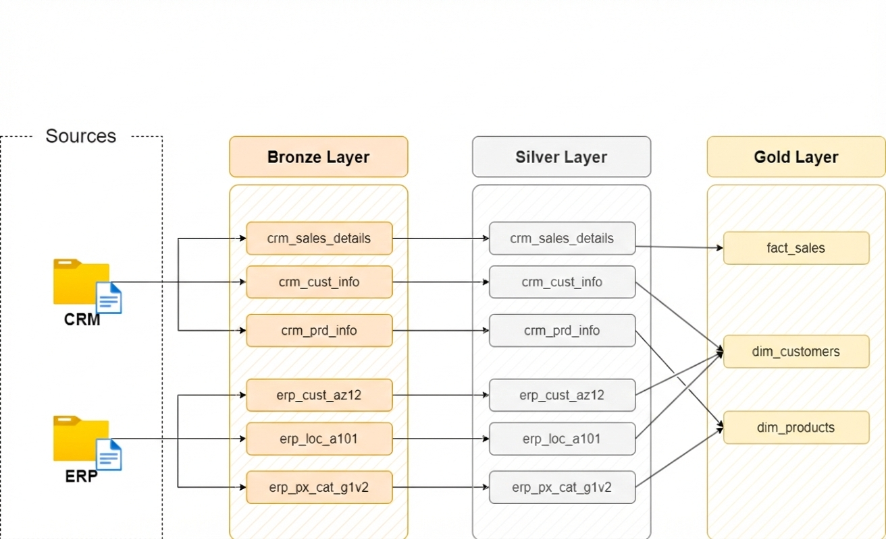
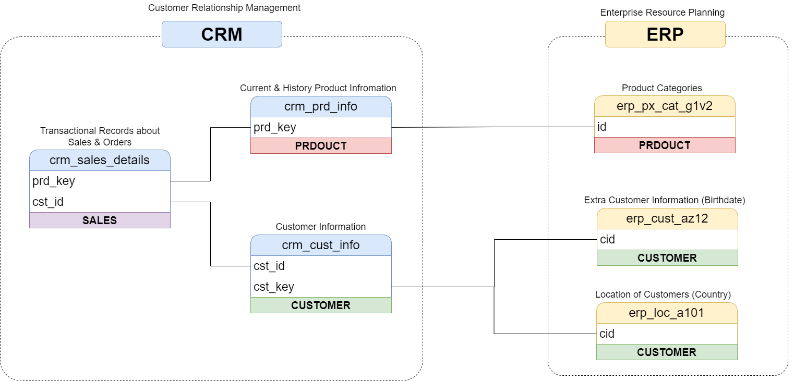

# 🚀 Modern Data Warehouse & Analytics Project

This repository demonstrates an end-to-end Data Engineering and Business Intelligence solution. The project transforms raw, disparate data from **ERP** and **CRM** systems into a structured **Star Schema** using the **Medallion Architecture** to provide actionable business insights.

---

## 🏗️ Data Architecture

The architecture follows industry best practices by segregating data into three distinct layers to ensure quality, traceability, and performance.

### 🗺️ 1. High-Level System Architecture
The overall flow from source systems through the warehouse layers to final consumption by BI tools.


### 🌊 2. Data Lineage & Pipeline Flow
A detailed view of how specific tables from ERP and CRM sources move through the Bronze and Silver layers to form the Gold layer models


### 🔗 3. ERP & CRM Data Integration
Visual representation of the relationships and primary/foreign key mappings used to integrate disparate source systems.



### The Medallion Layers:
1.  **Bronze (Raw)**: Ingests raw CSV files from source systems (ERP & CRM) into SQL Server. Data is kept in its original state to maintain a full history of the source.
2.  **Silver (Cleansed)**: Focuses on data quality. This layer involves data cleansing, handling nulls, standardizing date formats, and deduplicating records.
3.  **Gold (Curated)**: Houses business-ready data. Here, the data is modeled into a **Star Schema** (Fact and Dimension tables) optimized for analytical queries and BI dashboarding.

---

## 📖 Project Overview

This project serves as a technical showcase for the following disciplines:

* **Data Engineering**: Building robust ETL/ELT pipelines within SQL Server.
* **Data Modeling**: Designing a Star Schema for optimized analytical performance.
* **Data Quality**: Implementing logic to reconcile data inconsistencies between different source systems.


---

## 🛠️ Tech Stack & Tools

| Category | Tool | Purpose |
| :--- | :--- | :--- |
| **Database** | SQL Server Express | Data storage and warehousing |
| **GUI** | SSMS | Database management and SQL development |
| **Design** | Draw.io | Architecture and Data Model (ERD) design |
| **Documentation** | Notion / Markdown | Project tracking and technical docs |
| **Version Control** | Git / GitHub | Code management and collaboration |

---

## 📂 Repository Structure

```text
data-warehouse-project/
│
├── datasets/           # Raw CSV files (ERP and CRM data)
│
├── docs/               # Project documentation & diagrams
│   ├── data_architecture.drawio   # Flow diagram
│   ├── data_models.drawio         # Star Schema (ERD)
│   └── data_catalog.md            # Metadata and field descriptions
│
├── scripts/            # SQL Scripts for the ETL pipeline
│   ├── bronze/         # Loading raw data into SQL Server
│   ├── silver/         # Cleaning & standardization logic
│   └── gold/           # Final analytical model creation
│
├── tests/              # Data validation and unit test scripts
